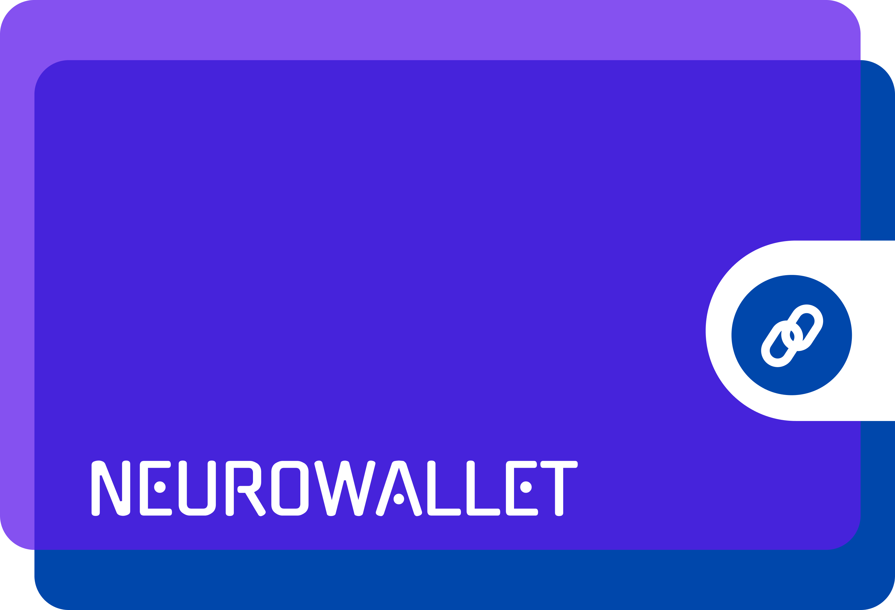

# Xion Hackathon

<div align="center">
<br>

<sub>Figure 1 - Logo</sub>



<sup>Source: Material produced by the authors (2025)</sup>
</div>

# NeuroWallet: Easy Finance via Whatsapp

Description Description Description Description Description Description Description Description Description Description Description Description Description Description Description Description Description Description Description Description Description Description Description Description Description Description

[**Demo video**](LINK)

[**Pitch video**](LINK)

[**Slides**](https://pitch.com/v/neurowallet-f26s64)

# Table of Contents
- [1. Introduction](#1-introduction)
- [2. Problem](#2-problem)
- [3. Solution](#3-solution)
  - [3.1 Personas](#31-personas)
  - [3.2 Value Proposition Canvas](#32-value-proposition-canvas)
- [4. Technologies](#4-technologies)
  - [4.1. What makes it unique](#41-what-makes-it-unique)
  - [4.2. Tech Stack](#42-tech-stack)
- [5. Demo](#5-demo)
- [6. Market and Business Model](#6-market-and-business-model)
- [7. Benchmark and Competitive Analysis](#7-benchmark-and-competitive-analysis)
- [8. Future Plans](#8-future-plans)
- [9. Installation Guide](#9-installation-guide)
  - [9.1. Prerequisites](#91-prerequisites)
  - [9.2. Clone the Repository](#92-clone-the-repository)
  - [9.3. Additional Steps](#93-additional-steps)
  - [9.4. Troubleshooting](#94-troubleshooting)
  - [9.5. Additional Resources](#95-additional-resources)
- [10. FAQ](#10-faq)
- [11. Team](#11-team)
- [12. Appendix](#12-appendix)

<br>

# 1. Introduction

# 2. Problem

Neurowallet combines DeFi (Decentralized Finance) technologies, Artificial Intelligence, and WhatsApp integration to solve critical problems faced by Individual Microentrepreneurs (MEIs) and Small and Medium Enterprises (SMEs).

### The Fiscal and Bureaucratic Problem for SMEs

#### Brazilian Scenario

In Brazil, the fiscal situation for small businesses is particularly challenging. Sage research reveals an alarming reality: microenterprises with up to five employees pay approximately 65% of their revenue in taxes, while small businesses (5-19 employees) pay 42%, and medium-sized businesses (20-199 employees) pay 30%. This disproportionate distribution shows how smaller businesses are more severely impacted by the tax system.

Bureaucratic complexity further aggravates this scenario. Brazilian microenterprises spend an average of 14.5 days per year exclusively on tax accounting, equivalent to 2.6% of annual work dedicated solely to complying with tax obligations.

However, formalization brings substantial benefits. Studies by Sebrae in partnership with FGV demonstrate that the economic effect of formalizing MEIs moves between R$19.81 billion and R$69.56 billion annually in Brazil. Entrepreneurs experience a 7% to 25% increase in their income after formalization, with data showing that formalized entrepreneurs can earn up to three times more, with an average additional R$2,300 monthly.

#### Portuguese Scenario

In Portugal, SMEs also face considerable challenges, although with some important distinctions compared to Brazil. The country has one of the highest tax burdens in the European Union, with a total tax and contribution rate for companies estimated at approximately 39.8% of commercial profits, according to World Bank data.

Portuguese SMEs constitute the backbone of the national economy, representing 99.9% of the country's business fabric, accounting for 78.4% of employment and generating 63.5% of total added value. Despite this fundamental importance, these companies face administrative complexity that limits their growth potential.

Data from PwC and the World Bank indicate that Portuguese companies spend an average of 243 hours per year to comply with their tax obligations, significantly above the European average of 163 hours. For micro and small businesses with limited resources, this time represents a substantial indirect operational cost that directly affects their competitiveness.

The Portuguese tax system establishes for SMEs a Corporate Income Tax (IRC) with a standard rate of 21%, with reductions to 17% on the first €25,000 for small companies. Additionally, there is the municipal surcharge (up to 1.5%) and the state tax for higher profits, creating several layers of fiscal complexity.

### The Informal Economy and Its Costs

The informal economy represents a significant challenge in both Portugal and Brazil. In Portugal, it is estimated that the undeclared economy corresponds to approximately 17.5% of GDP, according to studies by the National Statistics Institute (INE). This percentage represents about €37.7 billion operating outside the formal system.

This informality has negative consequences for both the entrepreneurs themselves and the economy as a whole. Informal entrepreneurs face severe limitations, including:

1. Restricted access to credit and financial services
2. Inability to issue official invoices
3. Difficulties in establishing formal business partnerships
4. Exclusion from government business support programs
5. Limitations for export and internationalization

Studies by COTEC Portugal indicate that formalized companies have access to a potential market up to 3.6 times larger than informal companies, with an average revenue increase of 22% after formalization. Additionally, formalized entrepreneurs are 46% more likely to obtain bank credit and 58% more likely to establish partnerships with larger companies.

***"A significant problem, but we have many like this in the world, how can we solve it?"***

# 3. Solution

Neurowallet presents an innovative approach to the challenges faced by SMEs and MEIs, integrating three fundamental technological elements:

1. **Blockchain and DeFi Technology:** The use of cryptocurrencies and smart contracts allows for transactions with reduced costs, greater transparency, and security guaranteed by the distributed nature of the blockchain. This infrastructure eliminates traditional intermediaries, significantly reducing operational costs.

2. **Advanced Artificial Intelligence:** AI systems capable of processing texts and images to facilitate transactions, automate bureaucratic processes, and provide personalized financial insights. The AI analyzes tax documents, identifies legitimate tax optimization opportunities, and simplifies regulatory compliance.

3. **WhatsApp Interface:** Accessibility through an already widely used messaging platform eliminates the need for adaptation to new applications. This approach drastically reduces the learning curve, making advanced financial technologies accessible to entrepreneurs with different levels of technological familiarity.

***Why Whatsapp?***

Integrating Neurowallet with WhatsApp is a strategic decision that capitalizes on the app's widespread adoption in Brazil, Portugal and other coutries. In Brazil, WhatsApp more than 90% of cellphone owners use it everyday, while in Portugal, it's used by 93%. This extensive user base provides Neurowallet with an instant, familiar platform for its DeFi and AI-powered financial services.

By leveraging WhatsApp's popularity, Neurowallet overcomes significant barriers to entry, especially for small entrepreneurs and MEIs who may be hesitant to adopt new financial technologies. The familiarity of WhatsApp's interface reduces the learning curve, making advanced financial tools accessible to a broader audience. This approach is particularly beneficial in promoting financial inclusion and encouraging formalization of informal businesses.

### Specific Benefits for Entrepreneurs

For entrepreneurs in Portugal and Brazil, Neurowallet offers tangible benefits that directly address the identified problems:

1. **Reduction of Tax Costs:** The use of cryptocurrencies for commercial transactions allows for legitimate tax optimization, reducing operational costs compared to traditional banking systems. This economy can be particularly significant for international transactions, which currently can cost up to 7.5% of the transacted value through traditional banks.

2. **Bureaucratic Simplification:** The automation of administrative and fiscal processes through AI significantly reduces the hours dedicated to these tasks. Considering that Portuguese companies spend 243 hours annually on tax obligations, a reduction of just 30% in this time would represent a gain of more than 70 productive hours per year.

3. **Incentive for Formalization:** Operational ease and cost reduction make formalization more attractive and accessible. For informal entrepreneurs in Portugal, formalization facilitated by Neurowallet could represent an average increase of 22% in their revenue, following patterns observed in studies on business formalization.

4. **Facilitated International Transactions:** The possibility of operating globally with reduced costs is especially relevant for trade between Portugal and Brazil, which annually moves more than €2.3 billion and involves thousands of small companies in both countries.

5. **Digital Financial Inclusion:** Access to advanced financial services through a familiar interface eliminates technological barriers. This feature is particularly relevant in Portugal, where ANACOM data indicates that 93.7% of Portuguese smartphone owners regularly use WhatsApp.

***"Okay, but who is actually affected by this?"***

## 3.1 Personas

Personas are fictional representations of target users that encapsulate typical characteristics, interests, goals, and challenges of a specific audience. They help product teams better understand customer needs and create solutions that meet their expectations.

Personas are essential in the design thinking process and product development, facilitating the creation of more relevant and effective products or services.

<div align="center">
<br>

<sub>Figure 2 - Personas</sub>


<sup>Source: Material produced by the authors (2025)</sup>
</div>

### Maria Schmidt - Small Bakery Owner

#### Profile
Maria is a passionate 29-year-old bakery owner in Berlin, Germany. She's been running her artisanal bread business for 12 years and is looking to expand online across the country.

#### Challenges
- Time-consuming financial management and tax compliance
- High taxes and fees from traditional payment methods impacting profits
- Difficulty in expanding business due to costly transactions

#### How Neurowallet Helps Maria
- Automates tax compliance with AI-powered tools, saving time
- Provides lower-cost cryptocurrency transactions, reducing fees
- Enables easy online payments for customers across the country
- Offers real-time financial insights for better decision-making
- Simplifies business expansion with accessible financial tools

---

### Lucas Alves - Business Analytics Student

#### Profile
Lucas is a 22-year-old student from Portugal, currently studying business analytics at MIT in the USA. He's a keen blockchain enthusiast and an advocate for small businesses, often frustrated with the inefficiencies of traditional payment systems.

#### Challenges
- Disappointment with slow and costly traditional payment methods
- Desire to learn more about blockchain technology and its applications
- Frustration with current banking apps and their limitations in international transactions

#### How Neurowallet Helps Lucas
- Offers fast and cost-effective crypto transactions via WhatsApp, addressing his frustration with traditional systems
- Provides educational resources about blockchain and its impact on payment systems
- Enables support for small businesses through easy crypto payments
- Features a user-friendly interface, simplifying international transactions while studying abroad
- Allows Lucas to explore blockchain technology in real-world financial scenarios

<br>

***"And how do we create value for these personas?"***

## 3.2 Value Proposition Canvas

<div align="center">

<br>

<sub>Figure 3 - Value Proposition Canvas</sub>


<sup>Source: Material produced by the authors (2025) with Template from [Strategyzer.](https://www.google.com/url?sa=i&url=https%3A%2F%2Fwww.strategyzer.com%2Flibrary%2Fthe-value-proposition-canvas&psig=AOvVaw1mu8QB2T4G5ERnVzEeuh9Y&ust=1738958698227000&source=images&cd=vfe&opi=89978449&ved=0CBQQjRxqFwoTCIDyvo3sr4sDFQAAAAAdAAAAABAE)</sup>
</div>

**Customer Jobs:**

- **Fast and efficient financial transactions** - Execution of instant payments and transfers, overcoming limitations of traditional banking systems.
- **Tax optimization and reduction of banking costs** - Minimization of expenses related to taxes and fees, increasing business profit margins.
- **Simplified business formalization** - Smooth transition from informal to formal, unlocking access to credit and government benefits crucial for growth.
- **Automation of fiscal bureaucratic processes** - Elimination of repetitive manual tasks, freeing up time for strategic business activities.
- **Uncomplicated adoption of cryptocurrencies** - Seamless integration of blockchain technologies into daily business operations, without the need for advanced technical expertise.

---

**Pains:**

- **High tax burden on conventional transactions** - Excessive taxes that stifle cash flow and limit company growth.
- **Regulatory complexity and excessive bureaucracy** - Maze of fiscal rules and documentation that consume valuable time and resources.
- **Challenging financial management and fiscal compliance** - Difficulty in maintaining accurate records and fulfilling tax obligations without errors.
- **Inefficiency and learning curve in banking apps** - Unintuitive interfaces and slow processes that hinder productivity.
- **Limited access to comprehensive financial services** - Barriers preventing SMEs from accessing essential financial products for their development.
- **Bureaucratic processes that hinder growth** - Time-consuming procedures that delay critical decisions and business expansion.

---

**Gains:**

- **Substantial savings on fees and tax-related expenses** - Significant reduction in operational costs, directly increasing profitability.
- **Drastic simplification of business processes** - Transformation of complex tasks into simple and quick operations, improving overall efficiency.
- **Facilitated and secure global reach** - Expansion of potential market with simplified and protected international transactions.
- **Reliability and transparency via blockchain** - Immutable transaction record, increasing credibility and facilitating audits.
- **Real-time financial control with AI insights** - Clear and up-to-date view of financial health, enabling more informed and quick decisions.
- **Uncomplicated formalization for credit access** - Simplified regularization process, opening doors to financing and growth.
- **Expanded revenue potential through formalization** - New business opportunities and partnerships resulting from formal and transparent operations.

---

**Gain Creators:**

- **Real-time cost comparison tools between crypto and fiat** - Tool that highlights potential savings, facilitating strategic financial decisions.
- **Incentive programs to boost formal business registration** - Tangible rewards that motivate the transition to the formal economy, driving growth.
- **Enhanced business profile through verifiable blockchain records** - Verifiable financial history that increases reliability to partners and investors.
- **Facilitated access to tailored financial products for SMEs** - Direct bridge to credit options and financial services adapted to the specific needs of small businesses.

---

**Products and Services:**

- **Intelligent AI assistant for comprehensive financial management** - Smart system that simplifies everything from planning to execution of complex financial tasks.
- **WhatsApp-integrated cryptocurrency wallet** - Solution that transforms messages into secure and instant financial transactions.
- **Customizable compliance tools** - Adaptive suite that ensures compliance with diverse regulations, minimizing legal risks.

---

**Pain Relievers:**

- **Tax reduction compared to traditional payments** - Optimized cost structure resulting in real and immediate savings for the business.
- **User-friendly interface for navigating tax compliance** - Intuitive design that transforms fiscal complexity into simple and understandable steps.
- **Seamless crypto transactions through WhatsApp** - Integration that eliminates technical barriers, making crypto operations as simple as sending a message.
- **Comprehensive AI-powered automation of financial tasks** - Intelligent system that takes on the administrative workload, freeing up human resources for strategic tasks.

***"I understand, but how will all this work?"***

# 4. Technologies

Lorem ipsum dolor sit amet, consectetur adipisicing elit, sed do eiusmod tempor incididunt ut labore et dolore magna aliqua. Ut enim ad minim veniam, quis nostrud exercitation ullamco laboris nisi ut aliquip ex ea commodo consequat. Duis aute irure dolor in reprehenderit in voluptate velit esse cillum dolore eu fugiat nulla pariatur.

## 4.1 What makes it unique

## 4.2 Tech Stack

**Front-end:** React Native

**Back-end:** Python, Node Express 

# 5. Demo

Lorem ipsum dolor sit amet, consectetur adipisicing elit, sed do eiusmod tempor incididunt ut labore et dolore magna aliqua. Ut enim ad minim veniam, quis nostrud exercitation ullamco laboris nisi ut aliquip ex ea commodo consequat. Duis aute irure dolor in reprehenderit in voluptate velit esse cillum dolore eu fugiat nulla pariatur.

# 6. Market and Business Model

Lorem ipsum dolor sit amet, consectetur adipisicing elit, sed do eiusmod tempor incididunt ut labore et dolore magna aliqua. Ut enim ad minim veniam, quis nostrud exercitation ullamco laboris nisi ut aliquip ex ea commodo consequat. Duis aute irure dolor in reprehenderit in voluptate velit esse cillum dolore eu fugiat nulla pariatur.

***"Seems like a good idea, but does something similar already exist?"***

# 7. Benchmark and Competitive Analysis 

Lorem ipsum dolor sit amet, consectetur adipisicing elit, sed do eiusmod tempor incididunt ut labore et dolore magna aliqua. Ut enim ad minim veniam, quis nostrud exercitation ullamco laboris nisi ut aliquip ex ea commodo consequat. Duis aute irure dolor in reprehenderit in voluptate velit esse cillum dolore eu fugiat nulla pariatur.

***"What else?"***

# 8. Future Plans

Lorem ipsum dolor sit amet, consectetur adipisicing elit, sed do eiusmod tempor incididunt ut labore et dolore magna aliqua. Ut enim ad minim veniam, quis nostrud exercitation ullamco laboris nisi ut aliquip ex ea commodo consequat. Duis aute irure dolor in reprehenderit in voluptate velit esse cillum dolore eu fugiat nulla pariatur.

# 9. Installation Guide

## 9.1. Prerequisites

Lorem ipsum dolor sit amet, consectetur adipisicing elit, sed do eiusmod tempor incididunt ut labore et dolore magna aliqua. Ut enim ad minim veniam, quis nostrud exercitation ullamco laboris nisi ut aliquip ex ea commodo consequat. Duis aute irure dolor in reprehenderit in voluptate velit esse cillum dolore eu fugiat nulla pariatur.

## 9.2. Clone the Repository

```bash
git clone https://github.com/jonathanteoddoro/hackathon-xion.git
cd hackathon-xion
```

## 9.3. Additional Steps

Lorem ipsum dolor sit amet, consectetur adipisicing elit, sed do eiusmod tempor incididunt ut labore et dolore magna aliqua. Ut enim ad minim veniam, quis nostrud exercitation ullamco laboris nisi ut aliquip ex ea commodo consequat. Duis aute irure dolor in reprehenderit in voluptate velit esse cillum dolore eu fugiat nulla pariatur.

## 9.4. Troubleshooting 

Lorem ipsum dolor sit amet, consectetur adipisicing elit, sed do eiusmod tempor incididunt ut labore et dolore magna aliqua. Ut enim ad minim veniam, quis nostrud exercitation ullamco laboris nisi ut aliquip ex ea commodo consequat. Duis aute irure dolor in reprehenderit in voluptate velit esse cillum dolore eu fugiat nulla pariatur.

## 9.5. Additional Resources

Lorem ipsum dolor sit amet, consectetur adipisicing elit, sed do eiusmod tempor incididunt ut labore et dolore magna aliqua. Ut enim ad minim veniam, quis nostrud exercitation ullamco laboris nisi ut aliquip ex ea commodo consequat. Duis aute irure dolor in reprehenderit in voluptate velit esse cillum dolore eu fugiat nulla pariatur.

# 10. FAQ

## 10.1 Question 1

Answer 1

## 10.2 Question 2

Answer 2

## 10.3 Support

For support, send an email to gabriel.diniz@sou.inteli.edu.br.

# 11. Team

| [](https://www.linkedin.com/in/gabriel-scarpelin-diniz-425258144/) | [](https://www.linkedin.com/in/jonathanteoalves/) | [](https://www.linkedin.com/in/yanomã/) | [](https://www.linkedin.com/in/davi-abreu-da-silveira/) | [](https://www.linkedin.com/in/vinicius-testa-passos/) |
|:------------------------------------------------------:|:------------------------------------------------------:|:------------------------------------------------------:|:------------------------------------------------------:|:------------------------------------------------------:|
| **[Gabriel Scarpelin](https://www.linkedin.com/in/gabriel-scarpelin-diniz-425258144/)** | **[Jonathan Alves](https://www.linkedin.com/in/jonathanteoalves/)** | **[Yanomã Konwski](https://www.linkedin.com/in/thiagovolcati/)** | **[Davi Abreu](https://www.linkedin.com/in/davi-abreu-da-silveira/)** | **[Vinicius Testa](https://www.linkedin.com/in/vinicius-testa-passos/)** |

<br>

# 12. Appendix